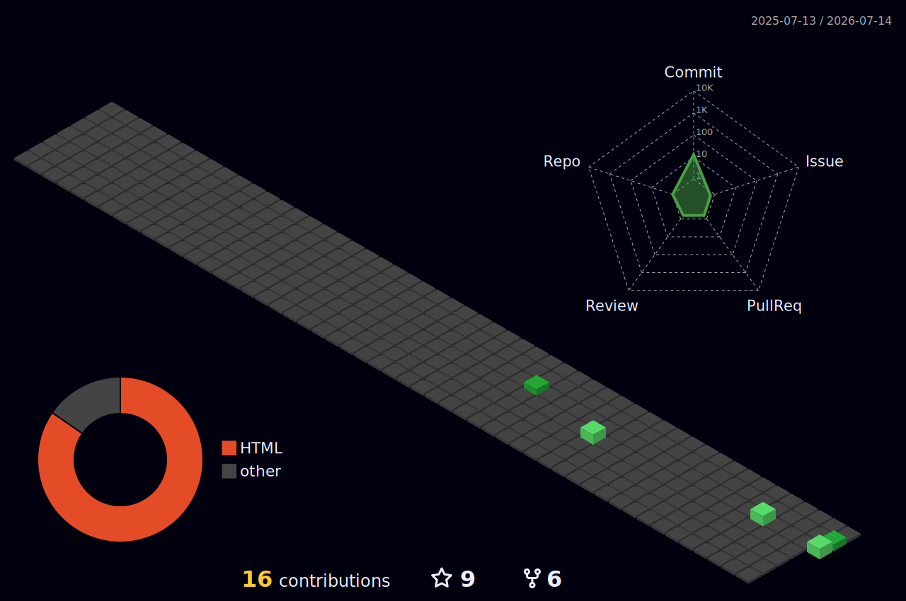

<h1 align="center">Hi there, I'm Prabhakar 👋</h1>

  

  
  
  

---

### 🙋‍♂️ About Me

- 🎓 **IITB '29 ICS**  | **NIT Surat '23 EE** 
- 🌱 Currently diving deeper into **Integrated Circuits and Systems**
- 👯 Open to collaborating on **open-source projects**
- 👨‍💻 Full project list on my **[Portfolio](https://jaiswalprabhakar.github.io/academic_portfolio)**
- 📫 Reach me at **prabhakarjaiswal8083430254@gmail.com**
- ⚡ Fun fact: I like 😼 cats 🐾

### 🚀 Languages & Tools

  
  
  
  
  
  

 

---

### 📊 GitHub Stats

 

  

    

Note: language stats reflect public code only and aren't a measure of skill or experience.

---
### 🧊 3D Contribution Calendar

  

---

### ❤️ Views & Followers

  
  

